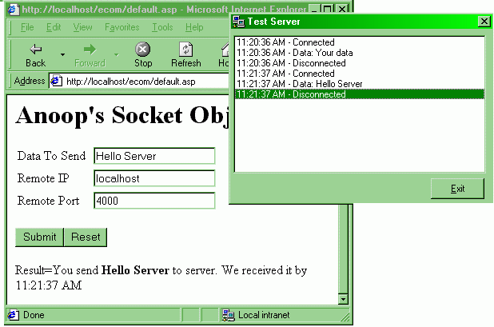



## IMPLEMENTING WEB TRANSACTION SYSTEMS: STEP BY STEP

### Description

This project is basically to demonstrate the Implementation of <b>WEB TRANSACTION SYSTEMS</b>.

You can use this component not just for implementing ECommerce transactions - but for any kind of socket based communication. Once you learn this project, you will get the concept for developing and implementing a number of features/technologies - like SMS, Chat Systems, Interaction with third party gateways, Instant Messengers etc.

This consists of three sections.

1) A COM DLL For wrapping Winsock Functionality.

2) An ASP file to test the component.

3) A Simple server to test the working of the system.

Each project is explained step by step, and the coding style is very simple with full of comments, so that even a very beginner can understand it with out any Fuss or Frills. Also, please vote for me people, simply because this is something so practical that you can use it in your own projects. :-)
 
### More Info
 

             |
---                |---
**Submitted On**   |2001-02-18 11:28:40
**By**             |[Anoop Madhusudanan](https://github.com/Planet-Source-Code/PSCIndex/blob/master/ByAuthor/anoop-madhusudanan.md)
**Level**          |Intermediate
**User Rating**    |4.8 (101 globes from 21 users)
**Compatibility**  |VB 4\.0 \(16\-bit\), VB 4\.0 \(32\-bit\), VB 5\.0, VB 6\.0, ASP \(Active Server Pages\) 
**Category**       |[Complete Applications](https://github.com/Planet-Source-Code/PSCIndex/blob/master/ByCategory/complete-applications__1-27.md)
**World**          |[Visual Basic](https://github.com/Planet-Source-Code/PSCIndex/blob/master/ByWorld/visual-basic.md)
**Archive File**   |[CODE\_UPLOAD151442182001\.zip](https://github.com/Planet-Source-Code/anoop-madhusudanan-implementing-web-transaction-systems-step-by-step__1-21117/archive/master.zip)

### Source Code

Kindly download the attached zip file for the article and three projects related with it. See the Readme file in the zip.

